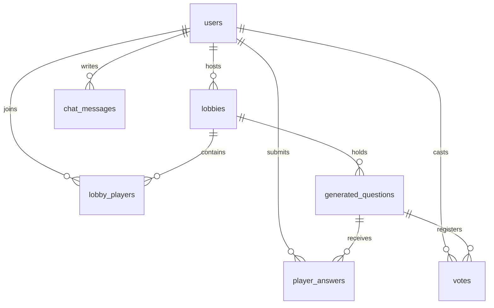
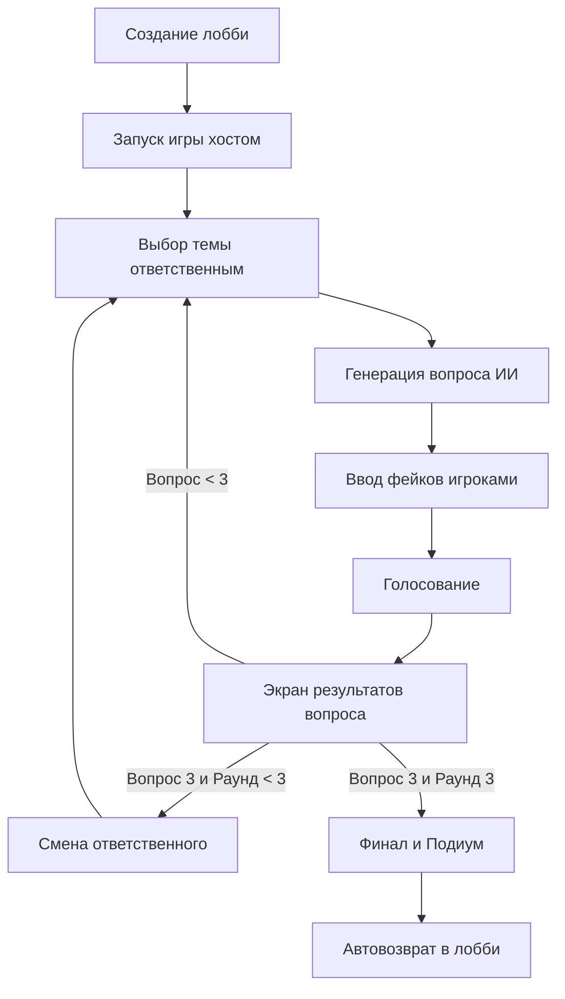

# 🌍 Куэте: Технический Манифест и Системная Документация

Данный документ объединяет в себе всю техническую информацию о проекте **Куэте** (от франц. *quête* — «поиск» или «квест»), включая архитектурный обзор, детальную структуру базы данных, регламент игровых режимов, принципы интеграции с ИИ, реестр функций (PHP и JS), а также историю устраненных проблем безопасности. Предназначен для разработчиков, занимающихся поддержкой и развитием проекта.

---

## 📋 1. Архитектурный Обзор Проекта

**Куэте** — это интерактивная онлайн-викторина с элементами блефа, использующая искусственный интеллект для генерации игрового контента. Игроки соревнуются в эрудиции и умении придумывать убедительную ложь (фейковые ответы), чтобы запутать оппонентов и набрать максимальное количество очков.

### Технологический Стек
*   **Backend:** PHP 8.1+ (сессии, PDO, компонент Ratchet для WebSockets).
*   **Frontend:** HTML5, CSS3, ES6 JavaScript (коммуникация через WebSocket + резервный Polling).
*   **База данных:** MySQL 5.7+ / 8.0+ (кодировка `utf8mb4`).
*   **ИИ (Ядро):** Groq API (модель `llama-3.1-8b-instant`) с поддержкой ключей других AI (Gemini/Cohere).

### Структура Директорий и Файлов
*   **`config.php`**: Глобальные конфигурационные настройки, загрузка переменных окружения из `.env`, константы.
*   **`database.sql`**: Полный SQL-дамп базы данных и описание обновлений.
*   **`hub.php`**: Интерфейс главного меню (список доступных лобби, создание новых комнат, модальное окно паролей).
*   **`lobby.php`**: Экран подготовки игроков перед матчем, чат, настройки комнаты.
*   **`game.php`**: Основное игровое окно мультиплеера с динамическим переключением этапов по WebSockets.
*   **`solo.php`**: Самодостаточная страница одиночной игры (локальная сессия, выбор одной темы, 3 вопроса).
*   **`register.php` / `login.php` / `logout.php`**: Система авторизации, регистрации и управления сессиями.
*   **`core/`**: Ядро бизнес-логики:
    *   `db.php` — Слой работы с БД через PDO, управление транзакциями и билетами авторизации.
    *   `auth_handler.php` — Обработчик авторизационных форм, валидация полей, CSRF.
    *   `ai_handler.php` — Модуль интеграции с Groq API, генерация контента и валидация тем.
*   **`ajax/`**: Асинхронные обработчики игровых запросов:
    *   `select_topic.php` / `send_fake.php` / `submit_vote.php` / `award_points.php` / `finalize_round.php` / `activate_next.php`
    *   `game_state_update.php` — Критически важный скрипт для fallback-polling. Синхронизирует текущее состояние игры для тех клиентов, у которых проблемы с WebSocket или которые перезагрузили страницу. Обнаруживает блокировочные файлы генерации ИИ.
*   **`websocket/`**: Логика реального времени:
    *   `GameWebSocket.php` — Класс компонента WebSocket-сервера на базе Ratchet, обработка событий, чат.
    *   `server.php` — Скрипт запуска WebSocket-демона.
*   **`assets/`**: Стили (`assets/css/game.css`) и вспомогательные клиентские скрипты (`assets/js/websocket-client.js`).
*   **`views/`**: Повторяющиеся HTML-компоненты (`views/chat.php`, `views/user_stats.php`, `views/header.php`, `views/footer.php`).

---

## 💾 2. Структура Базы Данных (MySQL)

База данных `quete_db` спроектирована с соблюдением требований третьей нормальной формы (3NF) и целостности связей.



### Спецификация Таблиц

#### 1. `users` (Профили и Глобальная Статистика)
*   `id` INT AUTO_INCREMENT PRIMARY KEY
*   `username` VARCHAR(50) NOT NULL (уникальные имена, проходящие строгую валидацию)
*   `email` VARCHAR(100) UNIQUE NOT NULL
*   `password_hash` VARCHAR(255) NOT NULL (хеши с использованием `PASSWORD_DEFAULT`)
*   `wins_count` INT DEFAULT 0 (число побед в мультиплеере)
*   `total_answers` INT DEFAULT 0 (всего данных ответов)
*   `correct_answers` INT DEFAULT 0 (количество правильных ответов)
*   `last_game_score` INT DEFAULT 0 (счет за последнюю сыгранную игру)
*   `ws_ticket` VARCHAR(255) DEFAULT NULL (одноразовый тикет авторизации WebSocket)
*   `created_at` TIMESTAMP DEFAULT CURRENT_TIMESTAMP

#### 2. `lobbies` (Игровые комнаты)
*   `id` INT AUTO_INCREMENT PRIMARY KEY
*   `host_id` INT (ссылка на хоста, `FOREIGN KEY` -> `users.id` ON DELETE CASCADE)
*   `lobby_name` VARCHAR(100) NOT NULL (санируется от HTML тегов)
*   `password` VARCHAR(50) DEFAULT NULL (пароль для приватных комнат)
*   `max_players` INT DEFAULT 8
*   `fake_answer_time` INT DEFAULT 60 (секунды на ввод лжи)
*   `is_active` BOOLEAN DEFAULT FALSE (флаг того, что в лобби уже идет игра)
*   `current_round` INT DEFAULT 1 (номер текущего раунда от 1 до 3)
*   `responsible` INT DEFAULT NULL (ID игрока, выбирающего тему, `FOREIGN KEY` -> `users.id` ON DELETE SET NULL)

#### 3. `lobby_players` (Участники комнат)
*   `id` INT AUTO_INCREMENT PRIMARY KEY
*   `lobby_id` INT (связь с лобби, ON DELETE CASCADE)
*   `user_id` INT (связь с пользователем, ON DELETE CASCADE)
*   `current_points` INT DEFAULT 0 (очки игрока в текущей игровой сессии)
*   `is_ready` BOOLEAN DEFAULT FALSE (статус готовности)

#### 4. `generated_questions` (История вопросов сессии)
*   `id` INT AUTO_INCREMENT PRIMARY KEY
*   `lobby_id` INT (ON DELETE CASCADE)
*   `topic` VARCHAR(50) NOT NULL (тема, санируется)
*   `question_text` TEXT NOT NULL
*   `correct_answer` TEXT NOT NULL
*   `fake_answers` JSON NOT NULL (массив из 10 эталонных фейков от ИИ)
*   `round_number` INT NOT NULL DEFAULT 1
*   `question_number` INT NOT NULL DEFAULT 1
*   `is_active` BOOLEAN DEFAULT FALSE (активен ли вопрос в данный момент)
*   `points_awarded` TINYINT(1) NOT NULL DEFAULT 0 (флаг предотвращения повторного начисления очков)
*   `auto_fakes_applied` TINYINT(1) NOT NULL DEFAULT 0 (флаг применения автоматических фейков по таймауту)
*   `auto_topic_selected` BOOLEAN DEFAULT FALSE
*   `created_at` TIMESTAMP DEFAULT CURRENT_TIMESTAMP

#### 5. `player_answers` (Фейки игроков)
*   `id` INT AUTO_INCREMENT PRIMARY KEY
*   `question_id` INT (ON DELETE CASCADE)
*   `user_id` INT (ON DELETE CASCADE)
*   `answer_text` TEXT NOT NULL (санируется)
*   `is_auto_selected` BOOLEAN DEFAULT FALSE (была ли применена авто-ложь по таймауту)
*   `created_at` TIMESTAMP DEFAULT CURRENT_TIMESTAMP

#### 6. `votes` (Голоса игроков)
*   `id` INT AUTO_INCREMENT PRIMARY KEY
*   `question_id` INT (ON DELETE CASCADE)
*   `voter_id` INT (ON DELETE CASCADE)
*   `selected_answer_text` TEXT NOT NULL

#### 7. `chat_messages` (Внутриигровой чат)
*   `id` INT AUTO_INCREMENT PRIMARY KEY
*   `lobby_id` INT (ON DELETE CASCADE)
*   `user_id` INT (ON DELETE CASCADE)
*   `message` TEXT NOT NULL (санируется с помощью `strip_tags` на сервере)
*   `created_at` TIMESTAMP DEFAULT CURRENT_TIMESTAMP

---

## 🎮 3. Регламент и Логика Игровых Режимов

В проекте функционируют два принципиально разных игровых режима:

| Параметр | 👥 Мультиплеер (Multiplayer Mode) | 👤 Соло-режим (Solo Mode) |
| :--- | :--- | :--- |
| **Количество игроков** | от 2 до 8 игроков | 1 игрок (локальная сессия) |
| **Количество раундов** | **3 раунда** | **1 раунд** (одна выбранная тема) |
| **Вопросов в раунде** | **3 вопроса** (всего 9 за игру) | **3 вопроса** |
| **Выбор темы** | Каждый раунд новая тема выбирается назначенным ответственным игроком | Одна тема задаётся в начале игры |
| **Запись результатов в БД**| Да (wins_count, correct_answers, total_answers) | **Нет** (чисто игровой интерес) |
| **Множители очков** | **x1** (1 раунд), **x2** (2 раунд), **x3** (3 раунд) | Отсутствуют (счёт в формате: **X из 3**) |

---

### 👥 3.1. Подробный Мультиплеерный Цикл (Multiplayer Loop)



#### Этап 1: Выбор темы (`state-topic` / `state-wait-topic`)
*   Случайным образом назначается ответственный игрок (`responsible`).
*   Ответственный видит интерфейс ввода темы (`state-topic`), остальные ожидают (`state-wait-topic`).
*   При отправке темы ответственным сервер создает временный файл `quete_lobby_{ID}_gen.tmp` через `sys_get_temp_dir()`. Благодаря этому у всех игроков (как через WebSockets, так и через AJAX-опросник) мгновенно и безотказно включается оверлей: `«Генерируем вопрос. Пожалуйста, подождите»`.

#### Этап 2: Ввод фейков (`state-fake` / `state-wait-fakes`)
*   Все участники видят вопрос от ИИ и должны написать правдоподобный фейковый ответ.
*   **Таймер ввода фейков**: Задается в настройках лобби хостом (20-120 сек). При остатке менее 10 сек счетчик окрашивается в красный.
*   **Авто-заполнение (Auto-Fakes)**: Если таймер истек, а игрок не отправил фейк, система транзакционно подставляет ему один из 10 эталонных ИИ-фейков, сгенерированных на этапе создания вопроса. Игра не зависает!

#### Этап 3: Голосование (`state-answer`)
*   На экран выводится перемешанный список: 1 правильный ответ + фейки всех игроков.
*   **Важное правило**: Игрок **не может** голосовать за собственный фейк. Система автоматически скрывает его фейк на его устройстве.
*   Этап завершается мгновенно по завершению голосования последним участником.

#### Этап 4: Результаты вопроса (`state-results`)
*   Зеленым подсвечивается верный ответ, раскрываются авторы всех фейков и голоса.
*   **Таймер результатов**: Строго **10 секунд**.
*   В фоне хост-клиент инициирует начисление очков (`award_points.php`) и генерацию следующего вопроса (`finalize_round.php`). 
*   **Защита от состояния гонки (Race Condition)**: `finalize_round.php` транзакционно вставляет неактивный "вопрос-заглушку", чтобы предотвратить повторные вызовы от хоста, и только затем отправляет запрос к ИИ. Текущий вопрос при этом **остается активным** все 10 секунд, что гарантирует, что экраны результатов у игроков не закроются досрочно. Если ИИ генерирует следующий вопрос дольше 10 сек, то после таймера игроки увидят стильный ретро-индикатор `«Генерируем вопрос. Пожалуйста, подождите»`.

#### Система начисления очков в мультиплеере:
*   **Правильный ответ**: 10 очков × Множитель раунда.
*   **Успешный блеф** (другой игрок выбрал ваш фейк): 5 очков за каждый голос × Множитель раунда.
*   Множители: **x1** (Раунд 1), **x2** (Раунд 2), **x3** (Раунд 3).

#### Этап 5: Подиум (`state-podium`)
*   После 3-го раунда (всего 9 вопросов) выводится пьедестал почета для топ-3 игроков.
*   Через **10 секунд** все игроки автоматически перенаправляются обратно в `lobby.php` по WebSocket команде.

---

### 👤 3.2. Подробный Цикл Соло-режима (Solo Loop)

Одиночная игра изолирована и ориентирована на мгновенное тестирование эрудиции:
1.  **Выбор темы (`state=topic`)**: Игрок вводит тему. На время генерации вопроса Groq API выводится заставка ожидания.
2.  **Ответ на вопрос (`state=play`)**: Показывается вопрос и 6 вариантов (1 верный + 5 эталонных фейков от ИИ). Время неограниченно.
3.  **Экран проверки (`state=check`)**: Сообщает «Правильно!» или «Неверно!», показывает верный ответ.
    *   **Таймер авто-перехода**: **10 секунд** с тикающими секундами. При клике на кнопку «Следующий вопрос» или по истечении 10 секунд запускается переход.
4.  **Результаты игры (`state=result`)**: Выводит «Ваш результат: X из 3». Доступны ретро-кнопки «Продолжить (Новая тема)» (очистка сессии) и «Выйти в хаб» (перенаправление на `hub.php`).

---

## 🤖 4. Интеграция с Groq API & Оффлайн-фолбэк (AI Fallback)

Генерация игрового контента выполняется через **Groq API** с моделью `llama-3.1-8b-instant`.

### Логика Обработки
1.  `validateTopicWithGroq($topic)`: ИИ верифицирует тему на цензуру, длину, адекватность и возвращает JSON `{ "valid": true/false }`.
2.  `generateQuestionWithGroq($topic, $previousQuestions)`: ИИ возвращает JSON:
    ```json
    {
      "valid": true,
      "question": "Текст вопроса...",
      "correct": "Правильный ответ...",
      "fakes": ["Фейк 1", "Фейк 2", ..., "Фейк 10"]
    }
    ```
3.  Для предотвращения повторений вопросов в рамках одной игры, функция принимает `$previousQuestions` — массив текстов ранее заданных вопросов, передавая его в системный промпт ИИ в качестве черного списка.

### Автономный режим (AI Fallback)
Если API возвращает ошибку, превышены Rate Limits или отсутствует интернет:
*   Система бесшовно перехватывает исключение и вызывает метод `generateQuestionStub($topic)`.
*   Метод генерирует локальные качественные вопросы-заглушки для викторины.
*   На игровом интерфейсе отображается элегантное ретро-уведомление:
    > ⚠️ **Проблема с ИИ**
    > ИИ временно недоступен. Игра переведена в автономный режим. Пожалуйста, подождите или выйдите.

---

## 🛠️ 5. Полный Реестр Функций Проекта

В проекте проведена очистка кода: все серверные дублирующие функции (такие как `kickPlayerFromLobby` или старые обёртки Gemini) полностью удалены. Ниже представлен актуальный каталог всех рабочих функций.

### 📂 Файл: `core/db.php`

| Имя функции | Описание |
| :--- | :--- |
| **`getPDO()`** | Возвращает синглтон-подключение PDO с настройками безопасности и эмуляции подготовленных выражений (`ATTR_EMULATE_PREPARES => false`). |
| **`generateCsrfToken()`** | Создает криптографически стойкий CSRF-токен и сохраняет его в сессии игрока. |
| **`getCsrfToken()`** | Извлекает CSRF-токен из сессии. Если он пуст, сначала генерирует его. |
| **`verifyCsrfToken($token)`** | Валидирует переданный токен в сессии с использованием безопасной функции `hash_equals`. |
| **`getUserById($userId)`** | Возвращает данные пользователя и статистику по его ID. |
| **`getUserByEmail($email)`** | Ищет и возвращает запись пользователя по адресу почты. |
| **`createUser($username, $email, $password)`** | Регистрирует нового пользователя в системе, хешируя его пароль с помощью `password_hash()`. |
| **`emailExists($email)`** | Проверяет, зарегистрирован ли уже переданный e-mail в БД. |
| **`createLobby($hostId, $name, $password, $max, $time)`** | Создает игровую комнату, предварительно очищая имя лобби с помощью `strip_tags(trim($name))`. |
| **`getLobbies()`** | Извлекает список доступных лобби для хаба. Сортирует сначала активные и незаполненные, затем полные. |
| **`getLobbyById($lobbyId)`** | Возвращает настройки конкретного лобби по его ID. |
| **`getLobbyByUserId($userId)`** | Возвращает настройки лобби, в котором на текущий момент состоит пользователь. |
| **`joinLobby($lobbyId, $userId)`** | Присоединяет игрока к лобби, проверяя приватность, вместимость и то, состоит ли он уже в другой комнате. |
| **`leaveLobby($lobbyId, $userId)`** | Удаляет запись игрока из `lobby_players`. Используется как для добровольного выхода, так и для кика хостом. |
| **`getLobbyPlayers($lobbyId)`** | Возвращает список всех подключенных к лобби игроков с их статусом готовности. |
| **`getPlayerScores($lobbyId)`** | Получает упорядоченный по очкам список игроков для лидерборда. |
| **`startGame($lobbyId)`** | Переводит статус комнаты в активное игровое состояние (`is_active = 1`) и назначает первого ответственного. |
| **`setRandomResponsible($lobbyId)`** | Назначает случайного ответственного игрока за выбор темы, стараясь не выбирать того, кто им был в прошлом раунде. |
| **`updateLobby($lobbyId, $name, $password, $max, $time)`** | Перезаписывает конфигурацию лобби хостом (имя санируется). |
| **`generateQuestion($lobbyId, $question, $correct, $fakes, ...)`** | Записывает сгенерированный ИИ вопрос и 10 эталонных фейков (в виде JSON) в БД. Тема санируется. |
| **`getCurrentQuestion($lobbyId)`** | Получает активный вопрос текущего раунда для лобби. |
| **`setPlayerReady($lobbyId, $userId, $isReady)`** | Обновляет готовность игрока. Хост всегда принудительно готов. |
| **`getLobbyResponsible($lobbyId)`** | Получает ID ответственного за выбор темы. |
| **`setLobbyResponsible($lobbyId, $userId)`** | Назначает конкретного игрока ответственным. |
| **`areAllPlayersReady($lobbyId)`** | Проверяет готовность абсолютно всех игроков (кроме хоста). |
| **`getPlayerCount($lobbyId)`** | Возвращает количество игроков в комнате. |
| **`submitFakeAnswer($questionId, $userId, $answer)`** | Сохраняет ложный ответ игрока, очищая его от HTML тегов через `strip_tags()`. |
| **`submitVote($questionId, $voterId, $answerText)`** | Фиксирует выбор игрока на голосовании. |
| **`getVotesForQuestion($questionId)`** | Подсчитывает голоса, отданные за все варианты ответа. |
| **`updatePlayerScore($lobbyId, $userId, $points)`** | Добавляет указанное количество очков игроку. |
| **`updateLobbyRound($lobbyId, $round)`** | Устанавливает номер текущего раунда в лобби. |
| **`deleteLobby($lobbyId)`** | Производит полную каскадную очистку лобби (удаляет голоса, фейки, вопросы, игроков и саму комнату). |
| **`getLobbiesForUser($userId)`** | Проверяет, в каких комнатах состоит игрок. |
| **`finishGame($lobbyId, $finalScores)`** | Финализирует сессию: начисляет победу топ-1 игроку, инкрементирует счетчики сыгранных игр и ответов у всех участников. |
| **`getRoundQuestions($lobbyId, $round)`** | Получает историю вопросов раунда для отчетов. |
| **`getPlayerAnswersForQuestion($questionId)`** | Возвращает фейки игроков для текущего вопроса. |
| **`getQuestionElapsedTime($questionId)`** | Возвращает время в секундах, прошедшее с момента создания вопроса. |
| **`isTopicSelectionTimedOut($questionId, $timeout)`** | Проверяет таймаут выбора темы. |
| **`autoSelectTopicForQuestion($questionId)`** | Устанавливает случайную тему при таймауте выбора. |
| **`getPlayersWithoutFakeAnswer($questionId, $lobby)`** | Выводит список игроков, которые еще не сдали свой фейк. |
| **`autoSelectFakeAnswerForPlayer($questionId, $userId)`** | Подставляет игроку случайный эталонный фейк ИИ при таймауте ввода лжи. |
| **`isVoteForOwnAnswer($questionId, $voterId, $ans)`** | Проверяет, проголосовал ли игрок за свой фейк (запрещено). |
| **`getPlayerOwnAnswer($questionId, $userId)`** | Достает фейковый ответ, предложенный данным пользователем на вопрос. |
| **`addChatMessage($lobbyId, $userId, $message)`** | Записывает сообщение чата в базу данных. |
| **`getChatMessages($lobbyId, $limit)`** | Извлекает историю чата для отображения новым игрокам при входе. |
| **`isWebSocketServerRunning()`** | Проверяет сокет-соединение на `WS_PORT` через `fsockopen` с таймаутом в 1 сек. |
| **`getPreviousQuestionTexts($lobbyId)`** | Возвращает массив текстов вопросов лобби для их исключения в будущем. |
| **`generateWebSocketTicket($userId)`** | Генерирует одноразовый UUID-билет авторизации WebSockets. |
| **`verifyWebSocketTicket($ticket)`** | Проверяет билет, сбрасывает его в БД и возвращает ID пользователя при успехе. |

---

### 📂 Файл: `core/ai_handler.php`

| Имя функции | Описание |
| :--- | :--- |
| **`sendGroqRequest($prompt, $config)`** | Универсальный метод Curl-запроса к Groq Cloud API. |
| **`validateTopicWithGroq($topic)`** | Возвращает валидность темы с точки зрения ИИ. |
| **`generateQuestionWithGroq($topic, $prev)`** | Обращается к Llama-3.1-8b для генерации вопроса, ответа и 10 эталонных фейков по теме. |
| **`generateFakeAnswerWithGroq($topic, $correct)`**| Генерирует одну качественную ложь по теме. |
| **`isAnswerTooCloseToCorrect($user, $correct)`** | Метод быстрой проверки схожести строк с помощью `similar_text()`. |
| **`generateQuestionStub($topic)`** | Локальная база вопросов-заглушек на случай отказа ИИ. |

---

### 📂 Клиентские JS Классы & Методы (`assets/js/websocket-client.js`)

*   **`constructor(url, ticket)`**: Инициализирует параметры и сохраняет одноразовый билет.
*   **`connect()`**: Создает объект `WebSocket`, вешает хуки авторизации и обрабатывает сетевой статус.
*   **`attemptReconnect()`**: Запускает интервальное переподключение при обрыве связи.
*   **`joinLobby(lobbyId)`**: Отправляет сокет-пакет входа игрока в лобби `{ action: "join", lobby_id: ... }`.
*   **`sendAction(type, data)`**: Отправляет игровое действие в WebSocket-канал.
*   **`notifyUpdate(data)`**: Сигнализирует о необходимости обновления UI.
*   **`sendChat(msgText, username)`**: Передает пакет отправки сообщения в чат.
*   **`escapeHtml(text)`**: **(Статический метод)** Предотвращает XSS за счет создания временного DOM-ноды `div` и чтения `textContent`.
*   **`updateStatusIndicator(status)`**: Обновляет визуальный сетевой индикатор лобби (Online / Connecting / Offline).

---

## 🛡️ 6. Безопасность и Валидация

В ходе разработки и последних аудитов безопасности в проекте были полностью решены следующие критические уязвимости:

### 1. Защита от CSRF-атак (Cross-Site Request Forgery)
*   **Проблема**: Ранее действия создания лобби, сдачи фейков и голосования не были защищены, что позволяло отправлять запросы извне.
*   **Решение**: Все ключевые POST формы в `lobby.php`, `game.php`, `register.php`, `login.php` снабжены скрытыми токенами CSRF `getCsrfToken()`. В обработчиках и AJAX эндпоинтах внедрена строгая проверка через `verifyCsrfToken()`. Выход из лобби (`leave_lobby.php`) переведен с небезопасного метода GET на POST.

### 2. Защита от XSS и инъекций вредоносного HTML/Audio кода
*   **Проблема**: Опасность внедрения игроками скриптов, iframe или тегов `<audio autoplay>` для проигрывания нежелательной музыки или воровства сессий через чат, фейковые ответы, темы или юзернеймы.
*   **Решение**:
    *   **Имена пользователей**: При регистрации в `core/auth_handler.php` имя строго проверяется регулярным выражением `^/[a-zA-Z0-9_а-яА-ЯёЁ.\-]+$/u`. Никаких тегов или спецсимволов.
    *   **Лобби, Темы и Фейки**: Все входящие строковые параметры перед записью в MySQL или трансляцией в WebSockets принудительно очищаются от любых HTML тегов с помощью функции `strip_tags(trim($value))`.
    *   **Чат**: Текст сообщений чата проходит очистку `strip_tags()` на сервере в `GameWebSocket.php`, а при выводе на клиентской стороне полностью экранируется с помощью надежной функции `GameWebSocketClient.escapeHtml()`.
    *   **Точечный XSS-аудит (game.php)**: Текст ошибки AJAX-запроса `data.error` теперь принудительно оборачивается в `GameWebSocketClient.escapeHtml(data.error || 'Ошибка')` при изменении DOM в `innerHTML` страницы.

### 3. Билетная авторизация WebSockets (Ticket-based WebSocket Auth)
*   **Проблема**: WebSocket-серверы по умолчанию не имеют доступа к PHP-сессиям, что могло позволить злоумышленнику подключиться под любым ID и отправлять ложные сокет-пакеты.
*   **Решение**: Внедрен механизм одноразовых билетов:
    1.  При загрузке страницы `lobby.php` генерируется случайный криптостойкий билет `ws_ticket` и сохраняется в БД.
    2.  Билет передается в URL-параметрах при подключении по WebSockets.
    3.  Класс `GameWebSocket` в методе `onOpen` считывает билет, проверяет его по БД и при совпадении привязывает валидный `user_id` и `username` к сокет-соединению, моментально сбрасывая билет в NULL. Неавторизованные соединения отбрасываются.
