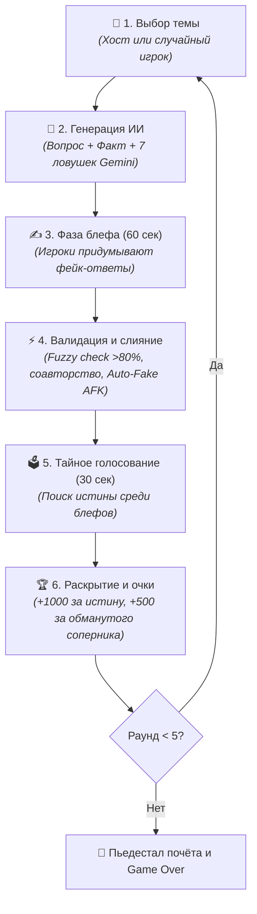
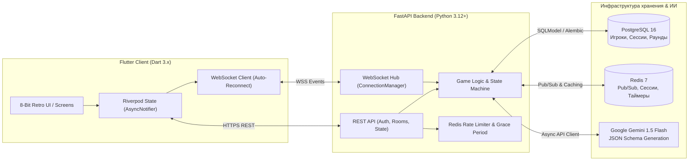

<p align="center">
  
</p>

<h1 align="center">🎮 QUETE — 8-Bit Multiplayer Bluffing Trivia</h1>

<p align="center">
  <b>Мультиплеерная квиз-игра нового поколения с механикой блефа, ретро 8-битной эстетикой и генеративным ИИ Google Gemini 1.5 Flash</b>
</p>

<p align="center">
  <a href="https://github.com/Gupkagrop/quete/actions"></a>
  <a href="docs/ROADMAP.md"></a>
  <a href="https://opensource.org/licenses/MIT"></a>
</p>

<p align="center">
  
  
  
  
  
  
  
  
  
</p>

<p align="center">
  <b>Языки документации:</b>
  <br>
  <b>🇷🇺 Русский</b> | <a href="README_en.md">🇬🇧 English</a>
</p>

---

```text
  ██████╗ ██╗   ██╗███████╗████████╗███████╗
 ██╔═══██╗██║   ██║██╔════╝╚══██╔══╝██╔════╝
 ██║   ██║██║   ██║█████╗     ██║   █████╗  
 ██║▄▄ ██║██║   ██║██╔══╝     ██║   ██╔══╝  
 ╚██████╔╝╚██████╔╝███████╗   ██║   ███████╗
  ╚══▀▀═╝  ╚═════╝ ╚══════╝   ╚═╝   ╚══════╝
```

---

## 📖 Оглавление

- [🌟 Концепция проекта](#-концепция-проекта)
- [🕹️ Игровой процесс (Core Game Loop)](#️-игровой-процесс-core-game-loop)
- [⚡ Ключевые архитектурные фичи](#-ключевые-архитектурные-фичи)
- [🏗️ Архитектура системы](#️-архитектура-системы)
- [🛠️ Стек технологий](#️-стек-технологий)
- [🗺️ Статус и дорожная карта (Roadmap)](#️-статус-и-дорожная-карта-roadmap)
- [🚀 Быстрый запуск (Quick Start)](#-быстрый-запуск-quick-start)
  - [1. Запуск БД и Redis в Docker](#1-запуск-бд-и-redis-в-docker)
  - [2. Запуск Backend (FastAPI + uv)](#2-запуск-backend-fastapi--uv)
  - [3. Запуск Client (Flutter)](#3-запуск-client-flutter)
  - [4. Запуск автоматических тестов](#4-запуск-автоматических-тестов)
- [📁 Структура репозитория](#-структура-репозитория)
- [📜 Лицензия](#-лицензия)

---

## 🌟 Концепция проекта

**Quete** (от франц. *quête* — «поиск, квест») — кроссплатформенная party-игра в реальном времени. 

В отличие от классических викторин, где всё решает сухое запоминание фактов, в **Quete** на первый план выходят:
* **Искусство дезинформации:** каждый игрок сочиняет убедительную ложь на сложный вопрос.
* **Психология и дедукция:** игроки пытаются отличить реальный факт от хитроумных блефов своих друзей.
* **Генеративный ИИ:** вопросы генерируются на лету нейросетью **Google Gemini 1.5 Flash**, поэтому контент никогда не повторяется.

Игра выполнена в **8-битной ретро-стилистике**: неоновая нео-аркадная палитра (`#0D0D0D`, `#00FF41`, `#FF00FF`), моноширинные шрифты, пиксельные кнопки и эффекты CRT-сканлайнов.

---

## 🕹️ Игровой процесс (Core Game Loop)

Каждый турнирный матч состоит из **5 раундов** со следующей механикой:



### Начисление очков:
* 🎯 **+1000 очков** — за выбор настоящего ответа (истины).
* 🎭 **+500 очков** — за каждого оппонента, проголосовавшего за ваш фейковый ответ.
* 🤝 **Разделение очков (+500 / N):** если двое или более игроков независимо ввели одинаковый блеф, сервер объединяет их в один вариант. При голосовании оппонентов авторы получают равную долю очков!
* 🚫 **Защита от читерства:** голосовать за собственный блеф строжайше запрещено на уровне протокола сервера.

---

## ⚡ Ключевые архитектурные фичи

- 🤖 **Structured Outputs Gemini 1.5 Flash:** генерация строго типизированного JSON с вопросом, верифицированным ответом и ровно 7 правдоподобными ложными альтернативами (`decoy_fallbacks`).
- 🛡️ **Fuzzy Matching ответов (>80%):** автоматическая проверка блефов игроков на расстояние Левенштейна против истинного ответа. Если игрок случайно ввел правильный ответ, сервер защищает тайну и просит ввести альтернативу.
- ⚡ **Auto-Fake Fallback:** если игрок отключился или не успел ввести блеф до конца таймера, сервер автоматически подставляет одну из заготовленных ИИ-ловушек. Динамика матча не прерывается ни на секунду.
- 🔄 **State Recovery при реконнекте (Mobile-First):** при потере сети клиент выполняет реконнект к сокету и запрашивает актуальный снимок матча через `GET /rooms/{code}/state` с миллисекундной синхронизацией таймеров.
- 🔒 **Многоуровневая безопасность:**
  - 6-значный PIN-код защищен `bcrypt` с криптографической солью.
  - Redis Rate Limiter блокирует брутфорс (максимум 5 попыток/мин, бан на 15 мин при превышении).
  - Защита от гонок и сбоев сети: 60-секундный Grace Period при ротации JWT Refresh-токенов.
  - Сокрытие текста ответов игроков в WebSocket-событиях вплоть до фазы голосования.

---

## 🏗️ Архитектура системы



---

## 🛠️ Стек технологий

| Компонент | Технология | Особенности и назначение |
| :--- | :--- | :--- |
| **Бэкенд** | **Python 3.12+**, **FastAPI** | Асинхронный высоконагруженный фреймворк с Pydantic v2. |
| **Пакетный менеджер** | **uv (Astral)** | Сверхбыстрый менеджер виртуальных окружений и зависимостей нового поколения. |
| **База данных** | **PostgreSQL 16**, **SQLModel** | Единые схемы моделей на базе SQLAlchemy 2.0 и Pydantic, миграции **Alembic**. |
| **Кэш и Pub/Sub** | **Redis 7** | Хранение сессий, атомарные таймеры, синхронизация комнат через Pub/Sub `room:{code}:channel`. |
| **Нейросеть (AI)** | **Google Gemini 1.5 Flash** | Генерация вопросов, верификация фактов и ловушек со Structured Outputs. |
| **Клиентское приложение** | **Flutter 3.x (Dart 3)** | Кроссплатформенный клиент: **Web, Android, iOS, Windows, macOS, Linux**. |
| **Архитектура клиента** | **Riverpod 2.x**, **go_router** | Реактивное состояние (`AsyncNotifierProvider`), декларативный роутинг с `AuthGuard`. |
| **UI & Стиль** | **8-Bit Retro / Pixel Art** | Моноширинный шрифт, пиксельные тени, палитра `#0D0D0D`, `#00FF41`, `#FF00FF`. |
| **Тестирование** | **pytest-asyncio**, **flutter test** | 100% покрытие ключевых модулей, изолированные in-memory тесты (`FakeRedis`, `aiosqlite`). |

---

## 🗺️ Статус и дорожная карта (Roadmap)

Проект разрабатывается по строгому 10-этапному регламенту (70 дней). Подробности в **[docs/ROADMAP.md](docs/ROADMAP.md)**.

```text
[████████████░░░░░░░░░░░░░░░░░░░░░░░░░░░░░░░░░░░░░] 20% Завершено
```

- [x] **Спринт 1: Фундамент и DevOps** *(День 1–7)*
  - Инициализация репозитория, Docker Compose (Postgres 16, Redis 7).
  - Скелет FastAPI бэкенда и скелет Flutter клиента.
  - Настройка GitHub Actions CI/CD с автозапуском тестов.
- [x] **Спринт 2: Авторизация и Сессии** *(День 8–14)*
  - Гостевая авторизация, 6-значный PIN с `bcrypt`, JWT токены (Access + Refresh).
  - Redis Rate Limiting (HTTP 429), ротация токенов с 60s Grace Period.
  - 8-bit дизайн-система Flutter, экран авторизации и главное меню.
- [ ] **Спринт 3: Лобби и WebSockets** *(День 15–21)* — 🔄 *В РАБОТЕ*
  - Код комнаты из 4 символов, хост лобби, смена хоста при дисконнекте.
  - WebSocket Hub с Redis Pub/Sub broadcast, `auth` handshake, очистка Zombie Rooms.
  - Экран лобби Flutter со списком игроков и пиксельной анимацией ожидания.
- [ ] **Спринт 4: Интеграция с Google Gemini 1.5 Flash** *(День 22–28)*
- [ ] **Спринт 5: Игровой цикл — Выбор темы и Раунд** *(День 29–35)*
- [ ] **Спринт 6: Фаза блефа и валидация ответов** *(День 36–42)*
- [ ] **Спринт 7: Голосование, Auto-Fallback и слияние** *(День 43–49)*
- [ ] **Спринт 8: Турнирный матч (5 раундов) и Очки** *(День 50–56)*
- [ ] **Спринт 9: Звуковой движок, пиксель-арт и эффекты** *(День 57–63)*
- [ ] **Спринт 10: Релизная сборка, E2E и деплой** *(День 64–70)*

---

## 🚀 Быстрый запуск (Quick Start)

### Требования
* **Python 3.12+** и пакетный менеджер **[uv](https://docs.astral.sh/uv/)**
* **Flutter SDK 3.x+**
* **Docker & Docker Compose**

---

### 1. Запуск БД и Redis в Docker

В корневой директории проекта выполните:
```bash
docker compose up -d
```
> Будут запущены PostgreSQL 16 (порт 5432) и Redis 7 (порт 6379).

---

### 2. Запуск Backend (FastAPI + uv)

```bash
cd backend

# Настройка переменных окружения
cp ../.env.example .env

# Синхронизация зависимостей через uv
uv sync

# Применение миграций базы данных
uv run alembic upgrade head

# Запуск сервера разработки с автоперезагрузкой
uv run uvicorn app.main:app --reload --host 0.0.0.0 --port 8000
```
> Документация Swagger UI будет доступна по адресу: [http://localhost:8000/docs](http://localhost:8000/docs)

---

### 3. Запуск Client (Flutter)

```bash
cd client

# Загрузка зависимостей
flutter pub get

# Запуск в браузере (Chrome)
flutter run -d chrome

# Или запуск на Windows Desktop
flutter run -d windows
```

---

### 4. Запуск автоматических тестов

#### Тесты бэкенда (pytest + ruff):
```bash
cd backend
uv run ruff check .
uv run pytest
```

#### Тесты клиента (flutter test + analyze):
```bash
cd client
flutter analyze
flutter test
```

---

## 📁 Структура репозитория

```text
quete/
├── .github/workflows/        # CI/CD пайплайны GitHub Actions
├── backend/                  # Бэкенд-сервис (FastAPI, SQLModel, Redis)
│   ├── alembic/              # Миграции структуры базы данных
│   ├── app/
│   │   ├── api/              # REST эндпоинты (auth, rooms, state)
│   │   ├── core/             # Конфигурация, безопасность (JWT/PIN), БД
│   │   ├── models/           # Модели SQLModel (Player, Room, Session, Round)
│   │   ├── schemas/          # Pydantic-схемы валидации запросов
│   │   ├── services/         # Сервисы сессий, комнат, Gemini API
│   │   └── websockets/       # WebSocket менеджер и Redis Pub/Sub
│   ├── tests/                # Модульные и интеграционные тесты (pytest)
│   └── pyproject.toml        # Зависимости и конфигурация uv
├── client/                   # Кроссплатформенный клиент (Flutter)
│   ├── lib/
│   │   ├── core/             # 8-bit ретро-тема, роутер, хранилище токенов
│   │   ├── models/           # Модели данных Dart
│   │   ├── state/            # Провайдеры Riverpod (Auth, Lobby, Game)
│   │   └── ui/
│   │       ├── screens/      # Экраны (Auth, Menu, Lobby, Bluff, Vote)
│   │       └── widgets/      # Пиксельные кнопки и компоненты
│   ├── test/                 # Тесты компонентов и провайдеров (flutter test)
│   └── pubspec.yaml          # Зависимости Flutter
├── docs/                     # Архитектурная документация и спринты
│   ├── assets/               # Графика и промо-баннеры
│   ├── architecture/         # Спецификации api.md, database.md, frontend.md
│   └── ROADMAP.md            # Генеральный план разработки (70 дней)
└── docker-compose.yml        # Инфраструктура PostgreSQL 16 + Redis 7
```

---

## 📜 Лицензия

Проект распространяется под открытой лицензией **MIT License**.
Создано с ❤️ для любителей ретро-аркад и интеллектуального блефа.
