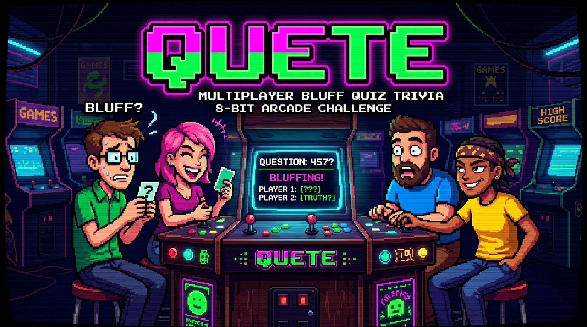
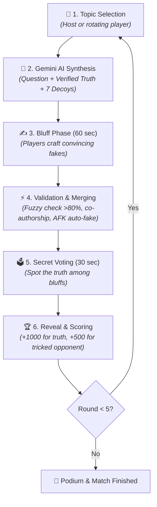
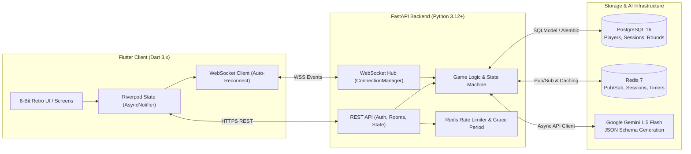

<p align="center">
  
</p>

<h1 align="center">🎮 QUETE — 8-Bit Multiplayer Bluffing Trivia</h1>

<p align="center">
  <b>A next-gen multiplayer trivia bluffing party game with 8-bit retro aesthetic and generative AI powered by Google Gemini 1.5 Flash</b>
</p>

<p align="center">
  <a href="https://github.com/Gupkagrop/quete/actions"></a>
  <a href="docs/ROADMAP.md"></a>
  <a href="LICENSE"></a>
</p>

<p align="center">
  
  
  
  
  
  
  
  
  
</p>

<p align="center">
  <b>Documentation Languages:</b>
  <br>
  <a href="README.md">🇷🇺 Русский</a> | <b>🇬🇧 English</b>
</p>

---

```text
  ██████╗ ██╗   ██╗███████╗████████╗███████╗
 ██╔═══██╗██║   ██║██╔════╝╚══██╔══╝██╔════╝
 ██║   ██║██║   ██║█████╗     ██║   █████╗  
 ██║▄▄ ██║██║   ██║██╔══╝     ██║   ██╔══╝  
 ╚██████╔╝╚██████╔╝███████╗   ██║   ███████╗
  ╚══▀▀═╝  ╚═════╝ ╚══════╝   ╚═╝   ╚══════╝
```

---

## 📖 Table of Contents

- [🌟 Concept & Vision](#-concept--vision)
- [🕹️ Core Game Loop](#️-core-game-loop)
- [⚡ Key Architectural Features](#-key-architectural-features)
- [🏗️ System Architecture](#️-system-architecture)
- [🛠️ Technology Stack](#️-technology-stack)
- [🗺️ Status & Roadmap](#️-status--roadmap)
- [🚀 Quick Start](#-quick-start)
  - [1. Launch Database & Redis in Docker](#1-launch-database--redis-in-docker)
  - [2. Run Backend (FastAPI + uv)](#2-run-backend-fastapi--uv)
  - [3. Run Client (Flutter)](#3-run-client-flutter)
  - [4. Automated Testing](#4-automated-testing)
- [📁 Project Structure](#-project-structure)
- [📜 License](#-license)

---

## 🌟 Concept & Vision

**Quete** (derived from the French *quête* — "quest") is a cross-platform real-time multiplayer trivia party game.

Unlike conventional quizzes that merely reward dry memorization of facts, **Quete** celebrates:
* **The Art of Deception:** Every player authors a convincing lie in response to obscure trivia questions.
* **Psychology & Deduction:** Players must distinguish genuine facts from clever decoys crafted by their friends.
* **Generative Intelligence:** Questions and verified facts are generated on-the-fly by **Google Gemini 1.5 Flash**, guaranteeing that no two games are ever alike.

The game embraces an **8-bit arcade retro style**: dark cybernetic neon palette (`#0D0D0D`, `#00FF41`, `#FF00FF`), monospace typography, pixelated box-shadow buttons, and CRT scanline aesthetics.

---

## 🕹️ Core Game Loop

Each tournament match consists of **5 rounds** following this rigorous real-time loop:



### Scoring System:
* 🎯 **+1000 Points:** Awarded for identifying the verified real truth.
* 🎭 **+500 Points:** Awarded for every rival player who voted for your fake bluff.
* 🤝 **Split Score (+500 / N):** If two or more players submit identical bluffs, the server merges them into a single option. When opponents vote for it, the authors share the points equally!
* 🚫 **Anti-Cheat:** Voting for your own submission is strictly forbidden at the server protocol level.

---

## ⚡ Key Architectural Features

- 🤖 **Gemini 1.5 Flash Structured Outputs:** Strictly typed JSON generation containing the trivia question, verified answer, and exactly 7 decoy fallbacks.
- 🛡️ **Levenshtein Fuzzy Matching (>80%):** Real-time similarity check preventing players from spoiling the truth. If a bluff is too close to the real answer, the server requests an alternative.
- ⚡ **Auto-Fake Fallback:** If a player disconnects or lets the timer expire, the engine instantly supplies an AI-crafted decoy. The match pace never stalls.
- 🔄 **Mobile-First State Recovery:** Seamless reconnection on unstable mobile networks via WebSocket handshake and state snapshot query (`GET /rooms/{code}/state`).
- 🔒 **Defense in Depth Security:**
  - 6-digit PIN hashed via `bcrypt` with cryptographic salt.
  - Redis Rate Limiter mitigating brute force (max 5 attempts/min, 15-minute lockout).
  - 60-second Grace Period for JWT Refresh token rotation under mobile network drops.
  - Bluff text remains redacted in WebSocket events until the voting phase begins.

---

## 🏗️ System Architecture



---

## 🛠️ Technology Stack

| Layer | Technology | Details & Purpose |
| :--- | :--- | :--- |
| **Backend** | **Python 3.12+**, **FastAPI** | High-performance async REST & WebSocket web server with Pydantic v2. |
| **Package Manager** | **uv (Astral)** | Blazing-fast virtual environment and package manager. |
| **Database** | **PostgreSQL 16**, **SQLModel** | Unified schema models bridging SQLAlchemy 2.0 and Pydantic with **Alembic** migrations. |
| **Cache & Pub/Sub** | **Redis 7** | Fast session state, atomic round timers, and room event broadcasting (`room:{code}:channel`). |
| **Artificial Intelligence** | **Google Gemini 1.5 Flash** | Dynamic trivia synthesis via strict JSON Schema Structured Outputs. |
| **Client Application** | **Flutter 3.x (Dart 3)** | Unified cross-platform codebase: **Web, Android, iOS, Windows, macOS, Linux**. |
| **Client Architecture** | **Riverpod 2.x**, **go_router** | Reactive state (`AsyncNotifierProvider`), declarative routing with `AuthGuard`. |
| **UI & Styling** | **8-Bit Retro / Pixel Art** | Monospace typography, hard pixel borders, `#0D0D0D`, `#00FF41`, `#FF00FF` palette. |
| **Testing** | **pytest-asyncio**, **flutter test** | 100% test coverage for critical modules, isolated in-memory test suites (`FakeRedis`, `aiosqlite`). |

---

## 🗺️ Status & Roadmap

Quete is built following a strict 10-sprint plan (70 days). See **[docs/ROADMAP.md](docs/ROADMAP.md)** for details.

```text
[████████████░░░░░░░░░░░░░░░░░░░░░░░░░░░░░░░░░░░░░] 20% Completed
```

- [x] **Sprint 1: Foundation & DevOps** *(Days 1–7)*
  - Monorepo structure, Docker Compose (Postgres 16, Redis 7).
  - FastAPI skeleton & Flutter client skeleton.
  - GitHub Actions CI/CD with automated test runs.
- [x] **Sprint 2: Auth & Sessions** *(Days 8–14)*
  - Guest authentication, 6-digit PIN with `bcrypt`, JWT tokens (Access + Refresh).
  - Redis Rate Limiter (HTTP 429), token rotation with 60s Grace Period.
  - 8-bit Flutter design system, authentication UI, and main menu.
- [ ] **Sprint 3: Lobby & WebSockets** *(Days 15–21)* — 🔄 *IN PROGRESS*
  - 4-character room codes, host assignment, host migration on disconnect.
  - WebSocket Hub with Redis Pub/Sub broadcast, `auth` handshake, Zombie Room cleaner.
  - 8-bit lobby UI in Flutter with player roster and start button.
- [ ] **Sprint 4: Google Gemini 1.5 Flash Integration** *(Days 22–28)*
- [ ] **Sprint 5: Core Game Loop — Topic Selection & Round** *(Days 29–35)*
- [ ] **Sprint 6: Bluff Phase & Submission Validation** *(Days 36–42)*
- [ ] **Sprint 7: Voting Phase, Auto-Fallback & Merging** *(Days 43–49)*
- [ ] **Sprint 8: Full Tournament Match & Scoreboard** *(Days 50–56)*
- [ ] **Sprint 9: Audio Engine, Pixel Art & Visual Polish** *(Days 57–63)*
- [ ] **Sprint 10: Production Release, E2E & Deployment** *(Days 64–70)*

---

## 🚀 Quick Start

### Prerequisites
* **Python 3.12+** and **[uv](https://docs.astral.sh/uv/)**
* **Flutter SDK 3.x+**
* **Docker & Docker Compose**

---

### 1. Launch Database & Redis in Docker

In the root directory:
```bash
docker compose up -d
```
> Starts PostgreSQL 16 (port 5432) and Redis 7 (port 6379).

---

### 2. Run Backend (FastAPI + uv)

```bash
cd backend

# Setup environment variables
cp ../.env.example .env

# Sync dependencies using uv
uv sync

# Run database migrations
uv run alembic upgrade head

# Start development server with auto-reload
uv run uvicorn app.main:app --reload --host 0.0.0.0 --port 8000
```
> Interactive Swagger UI will be available at: [http://localhost:8000/docs](http://localhost:8000/docs)

---

### 3. Run Client (Flutter)

```bash
cd client

# Fetch Flutter dependencies
flutter pub get

# Launch in Chrome (Web)
flutter run -d chrome

# Or launch on Windows Desktop
flutter run -d windows
```

---

### 4. Automated Testing

#### Backend tests (pytest + ruff):
```bash
cd backend
uv run ruff check .
uv run pytest
```

#### Client tests (flutter test + analyze):
```bash
cd client
flutter analyze
flutter test
```

---

## 📁 Project Structure

```text
quete/
├── .github/workflows/        # GitHub Actions CI/CD pipelines
├── backend/                  # FastAPI backend service
│   ├── alembic/              # Database migrations
│   ├── app/
│   │   ├── api/              # REST endpoints (auth, rooms, state)
│   │   ├── core/             # Configuration, security (JWT/PIN), DB
│   │   ├── models/           # SQLModel models (Player, Room, Session, Round)
│   │   ├── schemas/          # Pydantic validation schemas
│   │   ├── services/         # Session, room, and Gemini API services
│   │   └── websockets/       # WebSocket hub & Redis Pub/Sub manager
│   ├── tests/                # Pytest unit & integration tests
│   └── pyproject.toml        # uv dependencies & project configuration
├── client/                   # Flutter cross-platform client
│   ├── lib/
│   │   ├── core/             # 8-bit retro theme, router, token storage
│   │   ├── models/           # Dart data models
│   │   ├── state/            # Riverpod providers (Auth, Lobby, Game)
│   │   └── ui/
│   │       ├── screens/      # Screens (Auth, Menu, Lobby, Bluff, Vote)
│   │       └── widgets/      # Pixel-styled buttons and UI elements
│   ├── test/                 # Component and unit tests
│   └── pubspec.yaml          # Flutter dependencies
├── docs/                     # Architecture specifications & sprint plans
│   ├── assets/               # Promotional graphics and banners
│   ├── architecture/         # Specifications (api.md, database.md, frontend.md)
│   └── ROADMAP.md            # 70-day master development plan
└── docker-compose.yml        # PostgreSQL 16 + Redis 7 services
```

---

## 📜 License

Distributed under the **[PolyForm Noncommercial License 1.0.0](LICENSE)**.

* ✅ **Permitted:** Free personal usage, casual party play with friends, academic research, architectural study, and non-commercial forks.
* 🚫 **Prohibited:** Any commercial use, paid SaaS hosting, distributing via commercial app stores (App Store, Google Play, Steam), or monetization without explicit prior written authorization from the copyright holder.

Crafted with ❤️ for lovers of retro arcade games and clever deception.
