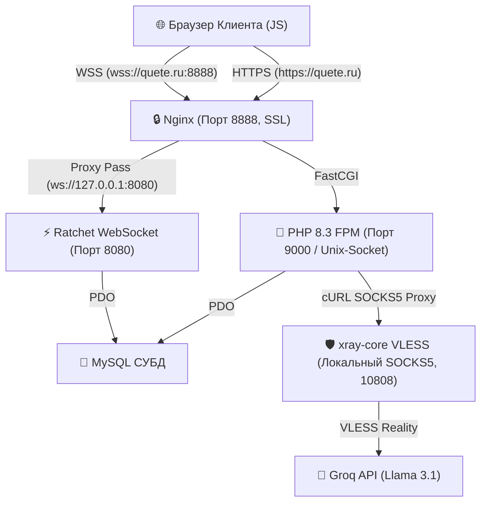

# 🎮 Глубокий технический анализ архитектуры игры «Куэте» (pre-alpha 0.1.3)

Этот документ представляет собой исчерпывающий архитектурный разбор игрового проекта **«Куэте»** (многопользовательская ретро-игра с использованием искусственного интеллекта в реальном времени). В нем детально описаны сетевой стек, базы данных, интеграция ИИ, системы безопасности, оптимизация ресурсов и принципы построения адаптивного интерфейса.

---

## 🧭 Общий обзор системы

Игра **«Куэте»** построена по клиент-серверной архитектуре с разделением обязанностей:
1. **Клиент (Фронтенд):** Чистый HTML5, модульный JavaScript и адаптивный CSS. Общение с сервером происходит по защищенному WebSocket (для игровых событий и чата) и через REST/AJAX API (для авторизации и резервного опроса).
2. **Сервер приложений (Бэкенд):** PHP 8.3-FPM (обработка HTTP и AJAX) и PHP-клиент Ratchet (асинхронный WebSocket-сервер).
3. **Хранилище данных:** MySQL (хранение пользователей, лобби, сообщений чата, вопросов ИИ и игровых очков).
4. **Интеграция ИИ:** Groq API (`llama-3.1-8b-instant`), работающий через защищенное VPN-соединение `xray-core` (VLESS Reality).

---

## 🌐 1. Архитектура сети и WebSocket

Для работы игры в реальном времени используется асинхронный сокет-сервер на базе **Ratchet (PHP)**. Подключение проксируется через веб-сервер Nginx для обеспечения SSL-шифрования и защиты данных.

### 📊 Диаграмма сетевых потоков и маршрутизации



### 🔑 Билетная авторизация WebSocket (Ticket-Based Auth)
Для предотвращения несанкционированного доступа и подмены личности игроков при сокет-соединении внедрена криптографически безопасная одноразовая система билетов:

1. **Генерация билета:** При авторизации на игровой странице (`lobby.php` / `game.php`) бэкенд генерирует случайный криптографический UUID-токен (`ws_ticket`), записывает его в таблицу `users.ws_ticket` и передает на клиент через глобальную JavaScript-переменную.
2. **Рукопожатие (Handshake):** Браузер при инициализации WebSocket-клиента передает этот токен в GET-параметре:
   ```javascript
   const socket = new WebSocket('wss://quete.ru:8888/?ticket=YOUR_UUID_TICKET');
   ```
3. **Серверная валидация:** В классе `GameWebSocket.php` в методе `onOpen(ConnectionInterface $conn)` сервер считывает GET-параметр `ticket`, проверяет его наличие в таблице `users` и связывает сокет-соединение с конкретным ID пользователя. Если билет невалиден или отсутствует, сокет принудительно закрывается (`$conn->close()`).

### 🔄 Резервный умный опрос (Smart Fallback Polling)
Для минимизации сетевого трафика и снижения нагрузки на сервер AJAX-полинг работает в режиме "умного резерва":
* При стабильном сокет-соединении периодические HTTP-запросы к `ajax/get_lobby_update.php` и `ajax/game_state_update.php` полностью **блокируются**.
* Если WebSocket-соединение теряет связь или не может подключиться (например, из-за сетевых ограничений клиента), JavaScript автоматически переходит в режим резервного AJAX-опроса (`fallback polling`) с интервалом в 10 секунд для синхронизации состояния лобби и игры.

---

## 🤖 2. Интеграция ИИ и отказоустойчивость

ИИ является ключевым геймплейным элементом, генерируя тематические вопросы и фейковые варианты ответов. 

### ⏱️ Синсхронизация статуса генерации ИИ
Поскольку генерация вопроса через Groq API занимает от 4 до 10 секунд, игрокам необходимо отображать правильный статус ожидания. Это реализовано без усложнения структуры БД:
1. Ответственный игрок отправляет выбранную тему.
2. Сервер перед началом запроса к API создает временный файл-лок в системной директории:
   ```php
   $lockFile = sys_get_temp_dir() . '/quete_gen_' . $lobbyId . '.lock';
   file_put_contents($lockFile, 'generating');
   ```
3. Все опрашивающие клиенты (через AJAX) или сокет-демон считывают наличие этого файла. Если файл существует, бэкенд возвращает флаг `isGenerating = true`, и все игроки видят аккуратную анимацию «Генерируем вопрос...».
4. По завершении генерации и записи вопроса в БД файл удаляется (`unlink($lockFile)`), а клиенты мгновенно получают обновленное игровое состояние.

### 🪵 Система оффлайн-заглушек (AI Fallback Database)
При сбоях сети, исчерпании лимитов Groq API или отсутствии интернет-соединения в ядро `core/ai_handler.php` интегрирован бесшовный локальный оффлайн-механизм:
* **База знаний:** Локальный справочник содержит прописанные вручную вопросы повышенного качества по **12 популярным категориям** (История, Наука, Спорт, Искусство, Кино, Литература, География, Музыка, Технологии, Космос, Еда, Природа).
* **Fuzzy-поиск (Размытый поиск):** При отправке темы выполняется регистронезависимый поиск по подстроке (`mb_strpos`), что позволяет корректно обрабатывать частичные совпадения (например, «про космос!» или «Наука» сопоставляются с соответствующими категориями).
* **Случайный выбор:** Если тема абсолютно уникальна и не совпала ни с одной категорией, система выбирает случайный вопрос из общего оффлайн-массива, предотвращая зависание игры.

---

## 🛡️ 3. Безопасность и Модерация контента

Безопасность пользователей и соответствие законодательству РФ (ФЗ-152, ФЗ-436, ФЗ-149) обеспечены на всех уровнях архитектуры.

### 🤬 Интеллектуальная leetspeak-устойчивая цензура мата
Функция цензурирования `moderateChatMessage($message)` в [core/db.php](file:///c:/OSPanel/domains/quete/pre-alpha0.1.3-antigravity-git/core/db.php) защищает чат от нецензурной лексики с использованием сложных регулярных выражений:
* **Борьба с обходом фильтров:** Регулярные выражения поддерживают мультисимвольные Юникод-классы, распознающие замену русских букв похожими латинскими символами, спецсимволами или цифрами (например, `п` -> `n`, `а` -> `@` / `4`, `е` -> `3` / `e`, `б` -> `6`).
* **Защита от ложных срабатываний:** Все матерные корни обернуты в строгие границы слов `\b` и специальные исключения, что гарантирует чистоту обработки. Слова «сабля», «рисунок», «влюбляться» или «сукно» **никогда** не будут подвергнуты цензуре.
* **Ретро-эвфемизмы:** Обнаруженные обсценные выражения заменяются случайными фразами в ретро-геймерском стиле:
  > `[ой!]`, `*бип*`, `[цензура]`, `[капец]`, `[ёшкин кот]`, `[ололо]`, `[милота]`, `[упс!]`, `[хм...]`, `[дружище]`.

### 📂 Защита служебных данных на уровне веб-сервера
В конфигурацию хоста Nginx на боевом сервере внедрены жесткие правила ограничения доступа:
```nginx
# Запрет скачивания бэкапов БД и дампов SQL
location ~* \.(sql|log|bak|conf)$ {
    deny all;
}

# Запрет доступа к служебным Markdown-руководствам
location ~* (DEPLOYMENT_GUIDE_AGENT\.md|USER_VPS_GUIDE\.md|COMPLETED_WORK\.md|GENERAL\.md)$ {
    deny all;
}
```
*Это полностью защищает сервер от утечки конфиденциальной технической информации, логов и дампов базы данных.*

---

## 💾 4. Оптимизация производительности СУБД и Ресурсов

### 📈 Индексы базы данных
Для ускорения работы MySQL и снижения задержек при частом AJAX/WebSocket-опросе внедрены следующие индексы:
1. `idx_lobby_user` (`UNIQUE` на `lobby_players (lobby_id, user_id)`): гарантирует уникальное нахождение игрока в лобби и ускоряет проверки авторизации.
2. `idx_lobby_active_round` (на `generated_questions (lobby_id, is_active, round_number)`): ускоряет выборку активного вопроса в текущем раунде.
3. `idx_lobby_created` (на `chat_messages (lobby_id, created_at)`): оптимизирует выборку сообщений чата при полинге и WebSocket-загрузке истории.

### 🧹 Сборщик мусора СУБД (Lobby Garbage Collector)
Транзакционная функция `cleanupExpiredLobbies()` автоматически очищает устаревшие сессии комнат, неактивные более 2 часов.
* **Каскадное удаление:** Очищаются записи самого лобби, игроки, сообщения чата, сгенерированные вопросы, фейковые ответы и голоса.
* **Автозапуск:** Вызов сборщика встроен непосредственно в метод `getLobbies()`. При каждом заходе игроков в хаб лобби база данных автоматически очищает себя от накопившегося мусора без использования системного Cron.

### 🖼️ Оптимизация графических ресурсов (93% сжатия)
Все аватары пользователей и UI-элементы интерфейса оптимизированы с помощью Python-скрипта на базе библиотеки Pillow:
* **Аватары:** Сжаты до `128x128px` (JPEG, 80% качество), что сократило их вес с **500 КБ до 4-7 КБ**.
* **UI-иконки:** Приведены к разрешению `256x256px` с сохранением ретро-пиксельной четкости (вес снижен с **500 КБ до 20-35 КБ**).
* **Суммарный итог:** Общий вес папки `assets/img/` сократился с **11.48 МБ до 0.79 МБ (сэкономлено 93.1% трафика)**, что гарантирует мгновенную загрузку страниц у новых пользователей.

---

## 🎨 5. Ретро-дизайн и Адаптивная верстка

Дизайн игры «Куэте» выполнен в аутентичном плоском ретро-стиле (Flat Retro Arcade), сочетающем дух аркадных автоматов 80-х годов с современной читаемостью и удобством.

### 🎨 Цветовая палитра и UI-токены (CSS variables)
Стиль полностью построен на CSS-переменных, обеспечивающих легкую поддержку темного режима и высокую контрастность:
```css
:root {
    --bg-dark: #0f172a;          /* Глубокий темно-синий фон космоса */
    --pill-dark: #1e293b;        /* Фон карточек и контейнеров */
    --border-color: #334155;     /* Границы блоков */
    --accent-orange: #ff9f43;    /* Контрастный оранжевый для активных элементов */
    --btn-dark: #0f172a;         /* Темный фон кнопок */
    --btn-dark-edge: #475569;    /* Обводка кнопок */
    --text-light: #f8fafc;       /* Чистый белый текст */
    --text-muted: #94a3b8;       /* Серый текст для описаний */
    --font-retro: 'Yanone Kaffeesatz', sans-serif;
    --font-main: 'Poppins', sans-serif;
}
```

### 📱 Адаптивные медиа-запросы и мобильные правила
Для идеального отображения на любых экранах (от 320px до 4K) внедрены точечные медиа-запросы:
* **Гибкая сетка карусели:** На экранах `< 1024px` карусель-слайдер `.carousel` переходит на относительную ширину (`width: 100%`), а преимущества `.features-grid` выстраиваются в вертикальный стек.
* **Адаптивный пьедестал (Подиум):** Элемент `.podium-base` имеет резиновую ширину с жестким ограничением `max-width: 100%`. Это предотвращает обрезание границ на экранах смартфонов. Имена игроков снабжены правилом:
  ```css
  .podium-name {
      overflow: hidden;
      text-overflow: ellipsis;
      white-space: nowrap;
  }
  ```
* **Высота игрового окна:** Игровое состояние использует flex-параметр `flex-grow: 1` вместо жестких процентов. Это позволяет браузеру идеально вычислять высоту, полностью исключая горизонтальный и вертикальный скролл при открытии экранной клавиатуры на мобильных устройствах.

---

## 🛠️ 6. Серверное развертывание и службы VPS

Проект развернут на VPS-сервере под управлением чистой **Ubuntu 24.04 LTS**.

### 📋 Карта портов и сетевых служб
| Порт | Протокол | Служба | Описание |
| :--- | :--- | :--- | :--- |
| **80** | TCP (HTTP) | Nginx | Перенаправление всего трафика на HTTPS (Certbot) |
| **443** | TCP (HTTPS) | Nginx | Отдача статики, FastCGI PHP-FPM для PHP-скриптов |
| **8888** | TCP (WSS) | Nginx SSL | Внешний защищенный SSL-прокси для WebSockets |
| **8080** | TCP (WS) | Ratchet (local) | Внутренний WebSocket-сервер, слушающий только `127.0.0.1` |
| **10808**| TCP (SOCKS5) | xray-core (local)| Локальный VPN-клиент для обхода географических ограничений API |

### ⚙️ Конфигурация службы WebSocket (`systemd`)
Для обеспечения непрерывной работы WebSocket-сервера в фоне создана системная служба `/etc/systemd/system/quete-websocket.service`:
```ini
[Unit]
Description=Quete Game WebSocket Server
After=network.target mysql.service nginx.service xray.service

[Service]
Type=simple
User=www-data
WorkingDirectory=/var/www/quete
ExecStart=/usr/bin/php /var/www/quete/websocket/server.php
Restart=always
RestartSec=3
StandardOutput=syslog
StandardError=syslog
SyslogIdentifier=quete-websocket

[Install]
WantedBy=multi-user.target
```

---

## 🏁 Резюме архитектурной зрелости
Проект **«Куэте»** сочетает классический ретро-гейминг с современными подходами к безопасности и производительности. Отказ от тяжелых фреймворков в пользу оптимизированного ванильного кода позволил добиться высочайшей скорости работы и полной управляемости бэкенда на уровне PHP. Архитектура готова к высоким игровым нагрузкам и безопасному масштабированию.
