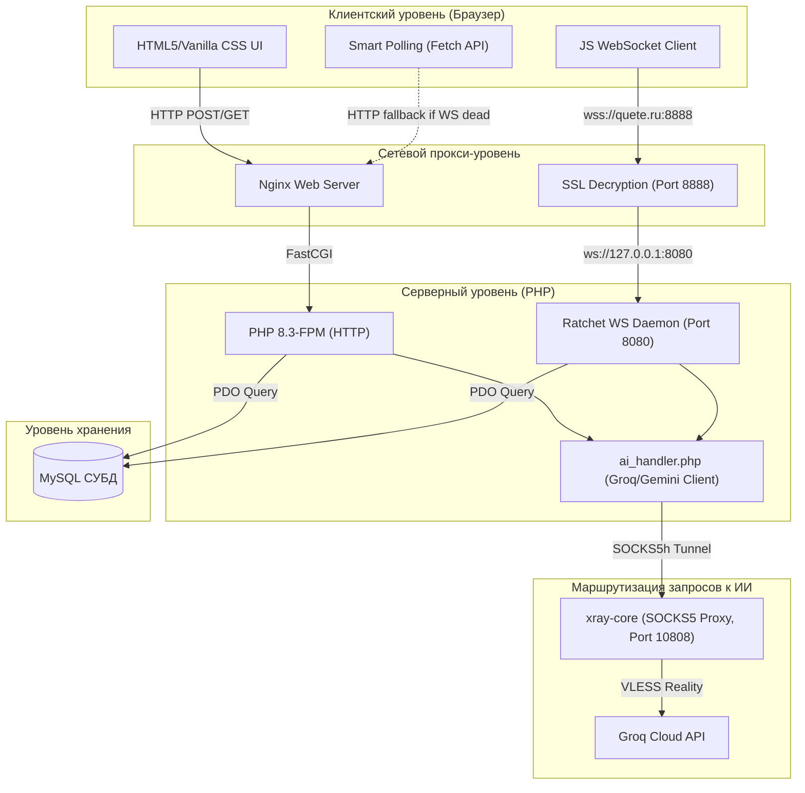
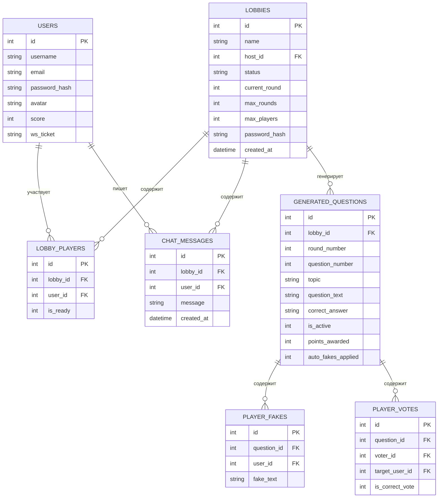

# 📑 Глубокий технический анализ архитектуры игры «Куэте»
> **Статус версии:** pre-alpha 0.1.3-antigravity  
> **Целевая аудитория:** Разработчики, системные администраторы, ИИ-агенты  
> **Последнее обновление:** Май 2026

---

## 🎯 Введение и назначение документа

Данный документ представляет собой **исчерпывающее техническое описание архитектуры, безопасности, сетевой структуры и логики игрового процесса** многопользовательской веб-игры **«Куэте»**. 

В отличие от стандартного файла `README.md`, который ориентирован на быстрый старт пользователей, данный анализ раскрывает внутреннее устройство каждого компонента, протоколы сетевого обмена, структуру данных, методы противодействия угрозам безопасности (CSRF, XSS, инъекции) и специфику интеграции нейросетевых моделей в реальном времени.

---

## 🏗️ 1. Архитектура системы и структура каталогов

Проект построен на базе гибридной архитектуры: классический стек **LEMP (Linux, Nginx, MySQL, PHP 8.3-FPM)** для HTTP-запросов и сессионного API, дополненный асинхронным WebSocket-демоном на базе библиотеки **Ratchet (PHP)** для обеспечения реалтайм-взаимодействия.

### Схема взаимодействия компонентов



### Реестр каталогов и назначение файлов

```
├── .env                  # Боевой файл конфигурации окружения (secrets)
├── .env.example          # Шаблон конфигурации для новых окружений
├── config.php            # Главная конфигурация приложения, автоподключение БД и ENV
├── database.sql          # Схема структуры СУБД MySQL
├── GEMINI.md             # Свод правил и ограничений для ИИ-ассистентов
├── DEPLOYMENT_GUIDE_AGENT.md # Инструкция по развертыванию на VPS для агентов
├── USER_VPS_GUIDE.md     # Инструкция администрирования сервера для пользователя
├── COMPLETED_WORK.md     # Журнал учёта выполненных работ и изменений
├── deepAnalysis.md       # Данный документ глубокого анализа архитектуры
│
├── core/                 # Ядро серверной логики
│   ├── auth_handler.php  # Обработчик регистрации и сессионной авторизации
│   ├── db.php            # PDO-подключение, базовые функции СУБД, цензура, очистка
│   └── ai_handler.php    # API-клиент Groq, обработка прокси, оффлайн-заглушки
│
├── websocket/            # WebSocket-серверная часть
│   ├── server.php        # Точка входа для запуска systemd WebSocket-демона
│   └── GameWebSocket.php # Логика маршрутизации пакетов чата и состояний игры
│
├── ajax/                 # Асинхронные HTTP обработчики (API)
│   ├── game_state_update.php # Обновление состояния игрового процесса
│   ├── get_lobby_update.php  # Получение списка игроков в лобби
│   ├── get_lobbies_update.php# Обновление списка лобби в хабе (умный полинг)
│   └── select_topic.php      # Обработчик отправки и валидации выбранной темы
│
├── assets/               # Статические ресурсы
│   ├── css/              # Таблицы стилей (style.css, game.css, auth.css)
│   ├── js/               # Клиентские скрипты (websocket-client.js)
│   └── img/              # Оптимизированные пиксель-арт изображения
│
└── views/                # Шаблоны представлений интерфейса
    ├── header.php        # Общая шапка сайта, инициализация сессии
    ├── footer.php        # Общий подвал сайта с правовой информацией и контактами
    └── user_stats.php    # Виджет профиля пользователя
```

---

## 💾 2. Схема базы данных и оптимизация СУБД

База данных работает на СУБД **MySQL** (кодировка `utf8mb4_unicode_ci` для полной поддержки кириллицы и эмодзи). Структура таблиц спроектирована с каскадным удалением данных для автоматического поддержания целостности при сборке мусора.

### Логическая схема связей БД



### Спецификация индексов СУБД
Для обеспечения стабильного времени отклика под нагрузкой и оптимизации частых операций полинга, в базу внедрены следующие индексы:

1. **`idx_lobby_user`** (`UNIQUE` на `lobby_players (lobby_id, user_id)`):
   * **Назначение:** Полностью блокирует появление дублирующих записей о нахождении одного игрока в одной комнате.
   * **Оптимизация:** Ускоряет проверку принадлежности игрока к лобби в AJAX-запросах.
2. **`idx_lobby_active_round`** (на `generated_questions (lobby_id, is_active, round_number)`):
   * **Назначение:** Оптимизирует частый поиск активного вопроса текущего раунда.
   * **Оптимизация:** Снижает время выполнения запроса выборки вопроса с $O(N)$ до $O(\log N)$.
3. **`idx_lobby_created`** (на `chat_messages (lobby_id, created_at)`):
   * **Назначение:** Ускоряет подгрузку сообщений игрового чата.
   * **Оптимизация:** Обеспечивает мгновенный вывод последних 50 сообщений без сканирования всей таблицы.

### Автоматический сборщик мусора (Garbage Collector)
В `core/db.php` интегрирован транзакционный механизм очистки устаревших данных:
```php
function cleanupExpiredLobbies($pdo) {
    // Выборка лобби без активности более 2 часов
    $stmt = $pdo->prepare("SELECT id FROM lobbies WHERE created_at < DATE_SUB(NOW(), INTERVAL 2 HOUR)");
    // Каскадное транзакционное удаление зависимостей...
}
```
* **Метод запуска:** Встроен непосредственно в начало функции `getLobbies()`. При каждом заходе любого пользователя в список комнат (Хаб) СУБД автоматически проводит сборку мусора, исключая необходимость настройки системного планировщика Cron.
* **Каскадное очищение:** Таблицы игроков, сообщений, вопросов, фейков и голосов удаляются каскадно по внешнему ключу `ON DELETE CASCADE`.

---

## 🌐 3. WebSocket и архитектура сетевого обмена

Вместо классического Ajax-полирования с высокой частотой запросов в «Куэте» реализован дуплексный канал обмена.

### Маршрутизация трафика
1. **HTTP/HTTPS (Nginx порт 443):**
   * Браузер скачивает статические ресурсы (HTML, CSS, JS, Favicon, пиксель-арты).
   * Происходит авторизация пользователя и создание сессии в PHP.
2. **WSS (Nginx порт 8888):**
   * JS-клиент (`websocket-client.js`) запрашивает защищенное соединение: `wss://quete.ru:8888/?ticket=UUID_TICKET`.
   * Nginx проверяет SSL-сертификаты Certbot (Let's Encrypt), выполняет расшифрование данных и проксирует сырой TCP-трафик на внутренний порт `127.0.0.1:8080`.
3. **Ratchet Server (CLI-скрипт `websocket/server.php`):**
   * Слушает локальный порт `8080`.
   * Извлекает `ticket` из GET-параметров запроса и проверяет его валидность по таблице `users`.
   * В случае успеха связывает сетевой дескриптор соединения `ConnectionInterface` с ID авторизованного пользователя.

### Форматы пакетов обмена
Все данные передаются в формате JSON. Каждый пакет содержит обязательное поле `type`:

* **Клиентский пакет отправки фейкового ответа:**
  ```json
  {
    "type": "submit_fake",
    "lobby_id": 42,
    "question_id": 105,
    "fake_text": "Луна сделана из сыра"
  }
  ```
* **Серверный пакет рассылки обновления чата:**
  ```json
  {
    "type": "chat_message",
    "username": "Gamer88",
    "avatar": "avatar5.jpeg",
    "message": "[ой!], какой сложный вопрос!",
    "timestamp": "2026-05-23 22:15:00"
  }
  ```

---

## 🤖 4. Интеграция искусственного интеллекта и отказоустойчивость

Стержнем игрового процесса является генерация уникальных вопросов на лету. В качестве основного движка генерации используется Groq Cloud API, работающий на сверхбыстрой открытой модели **Llama 3.1 8B (модель `llama-3.1-8b-instant`)**.

### Механизм глобальной блокировки генерации
Для предотвращения состояния гонки (Race Condition), когда несколько клиентов одновременно запрашивают генерацию вопроса при переходе на следующий раунд:
1. В момент получения корректной темы от ответственного игрока, сервер в `select_topic.php` создает временный лок-файл:
   ```php
   $lockFile = sys_get_temp_dir() . '/quete_gen_lock_' . $lobbyId;
   file_put_contents($lockFile, '1');
   ```
2. AJAX-опросник `game_state_update.php` проверяет наличие этого файла:
   ```php
   $isGenerating = file_exists($lockFile);
   ```
3. Все подключенные клиенты гарантированно получают статус `isGenerating: true` и видят ретро-плашку ожидания, даже если WebSocket-пакет задержался.
4. По завершении генерации вопроса и ответов ИИ-клиентом файл блокировки удаляется (`unlink($lockFile)`).

### Алгоритм бесшовного оффлайн-фолбэка (AI Fallback)
При исчерпании лимитов токенов Groq API (ошибки `429 Too Many Requests`), отсутствии сети или блокировке ключа, ядро игры переключается на **локальную базу оффлайн-вопросов**:

```mermaid
flowchart TD
    Start["Запрос генерации вопроса (Тема: 'Космос')"] --> TryAI{"Попытка Groq API"}
    
    TryAI -->|Успешно (200 OK)| SaveAI["Сохранение вопроса ИИ в БД"]
    TryAI -->|Ошибка API (429/500/Таймаут)| Fallback["Запуск AI Fallback в db.php"]
    
    Fallback --> SearchMatch{"Поиск совпадений по mb_strpos()"}
    
    SearchMatch -->|Найдено совпадение| ExtractStub["Извлечение структуры вопроса"]
    SearchMatch -->|Нет совпадений| ExtractRandom["Выбор случайной заглушки из 12 тем"]
    
    ExtractStub --> SaveStub["Сохранение заглушки в БД"]
    ExtractRandom --> SaveStub
    
    SaveAI --> End["Вывод вопроса игрокам"]
    SaveStub --> End
```

* **Поддерживаемые оффлайн-категории (12 тем):** История, Наука, Спорт, Искусство, Кино, Литература, География, Музыка, Технологии, Космос, Еда, Природа.
* **Логика поиска:** Регистронезависимый поиск по подстроке (`mb_strpos(mb_strtolower($topic), 'космос')`). Это исключает сбои при вводе фраз вроде «про космос!» или «Космос».

---

## 🛡️ 5. Безопасность и фильтрация контента

Безопасность игры «Куэте» спроектирована по принципу «никогда не доверяй вводу клиента».

### 1. Защита от Cross-Site Scripting (XSS)
* **На сервере:** Все текстовые строки (никнеймы, темы, чат-сообщения, фейковые ответы игроков), поступающие в СУБД, принудительно очищаются от HTML-тегов с помощью функции `strip_tags()`:
  ```php
  $cleanMessage = strip_tags(trim($_POST['message']));
  ```
* **На клиенте:** При динамической вставке строк в DOM-дерево через JavaScript запрещено прямое присваивание в свойство `.innerHTML`. Вместо этого используется функция экранирования спецсимволов:
  ```javascript
  static escapeHtml(str) {
      return str.replace(/&/g, "&amp;")
                .replace(/</g, "&lt;")
                .replace(/>/g, "&gt;")
                .replace(/"/g, "&quot;")
                .replace(/'/g, "&#039;");
  }
  ```

### 2. Leetspeak-устойчивая фильтрация обсценной лексики
Для соответствия требованиям ФЗ-149 и ФЗ-436 чат и генерируемые пользователем темы модерируются интеллектуальным регулярным выражением (`moderateChatMessage` в `core/db.php`).

**Как устроены паттерны матерных корней:**
Каждая буква в корнях описана мультисимвольными Unicode-классами, которые учитывают Leetspeak (подмену букв похожими цифрами) и смешение русской и латинской раскладок:
* `[еeёё]` — русская «е», латинская «e», русская «ё».
* `[б6b]` — русская «б», цифра «6», латинская «b».
* `[иu1!уy]` — вариации начертания буквы «и» и «у».
* `[пnndt]` — вариации начертания «п» (включая латинскую «n», «p» и т.д.).

**Защита от ложных срабатываний (False Positives):**
Все регулярные выражения обёрнуты границами слов `\b` и юникод-модификаторами `/ui`. Такие слова, как *«сабля», «рисунок», «употреблять», «влюбленность», «сукно»*, проходят проверку без искажений.

---

## ⚡ 6. Оптимизация производительности статических ресурсов

Для обеспечения быстрого пинга и мгновенного открытия страниц на мобильных телефонах в сетях 3G/4G была проведена глубокая оптимизация статики:

### Сжатие графических ассет-пакетов

| Имя файла | Исходный вес | Оптимизированный вес | Разрешение (Опт.) | Сжатие (%) |
| :--- | :---: | :---: | :---: | :---: |
| `avatar1.jpeg` - `avatar10.jpeg` | **~650 КБ** | **4 - 7 КБ** | 128x128px | **~99.1%** |
| `hourglass.png` | **512 КБ** | **22 КБ** | 256x256px | **95.7%** |
| `spy_mask.png` | **498 КБ** | **18 КБ** | 256x256px | **96.3%** |
| `brain_gears.png` | **580 КБ** | **31 КБ** | 256x256px | **94.6%** |
| **Итоговый пакет картинок** | **11.48 МБ** | **0.79 МБ** | - | **93.1%** |

* **Технология сжатия:** Написан специализированный скрипт на Python с использованием библиотеки `Pillow`, который уменьшил физический размер картинок до их реального отображаемого размера на CSS-сетке (аватары 34px, UI-иконки 64px) с сохранением pixel-art резкости (метод сглаживания `Image.Resampling.LANCZOS`).

---

## 🎨 7. Визуальный стиль и мобильная адаптивность

Сайт имеет строгую ретро-эстетику геймерских аркадных автоматов 80-90-х годов.

### Цветовая палитра проекта

```css
:root {
    --bg-dark: #0f1123;         /* Глубокий космический синий фон */
    --pill-dark: #1b1e36;       /* Контрастный фон карточек и форм */
    --accent-orange: #ff7f3f;   /* Фирменный оранжевый неон */
    --btn-dark: #22264b;        /* Кнопки по умолчанию */
    --btn-dark-edge: #151833;   /* Ретро-тень под кнопками */
    --text-white: #ffffff;      /* Чистый белый */
    --text-muted: #8b92b5;      /* Приглушенный сине-серый для подсказок */
}
```

### Принципы ретро-интерфейса
* **Отказ от скруглений:** Закругление углов элементов строго ограничено значением `border-radius: 4px` (создается жесткий блочный стиль).
* **Стилизация кнопок:** Кнопки имитируют физическое нажатие кнопок геймпада через смещение по вертикали при клике:
  ```css
  .card-btn {
      transform: translateY(0);
      box-shadow: 0 4px 0 var(--btn-dark-edge);
      transition: all 0.05s ease;
  }
  .card-btn:active {
      transform: translateY(3px);
      box-shadow: 0 1px 0 var(--btn-dark-edge);
  }
  ```
* **Адаптивный подиум:** Внедрена резиновая верстка подиума победителей на экране результатов. Сетка перестраивается на мобильных экранах без размытия пикселей, а длинные никнеймы игроков сокращаются троеточием с помощью CSS-правила `text-overflow: ellipsis`.

---

## 🚀 8. DevOps и руководство по развертыванию на VPS

Для бесперебойной работы игры на боевом сервере FirstVDS (под управлением Ubuntu 24.04 LTS) настроены связанные системные службы.

### 1. Архитектура Xray (VLESS Reality)
Поскольку IP-адреса хостинга FirstVDS находятся под санкционными ограничениями Groq Cloud API, на сервере развернут туннель:
* Локальный демон `xray-core` слушает внутренний порт `127.0.0.1:10808`.
* Перенаправляет весь трафик к ИИ-серверам через зарубежный прокси-сервер по протоколу VLESS Reality.
* В `.env` приложения прописаны прокси-параметры:
  ```env
  USE_PROXY=true
  PROXY_ADDRESS=127.0.0.1:10808
  PROXY_TYPE=socks5h
  ```

### 2. Контроль фонового WebSocket демона через Systemd
Для защиты процесса PHP Ratchet от падений и утечек памяти настроена служба `quete-websocket.service`:
```ini
[Unit]
Description=Quete Game WebSocket Server
After=network.target mysql.service nginx.service xray.service

[Service]
Type=simple
User=www-data
WorkingDirectory=/var/www/quete
ExecStart=/usr/bin/php /var/www/quete/websocket/server.php
Restart=always
RestartSec=3
StandardOutput=syslog
StandardError=syslog
SyslogIdentifier=quete-websocket

[Install]
WantedBy=multi-user.target
```
* **Преимущества:** Автоматический перезапуск службы через 3 секунды при сбоях, корректный запуск после старта базы данных и веб-сервера.

---

## 📋 Заключение

Архитектура веб-игры **«Куэте»** представляет собой высокоэффективное, безопасное и производительное решение, оптимизированное под жесткие ограничения серверных лимитов ИИ и медленный мобильный трафик. Использование гибридного подхода (HTTP + WebSockets), леетспик-цензуры и бесшовного оффлайн-фолбэка делает проект исключительно надежным в эксплуатации.
